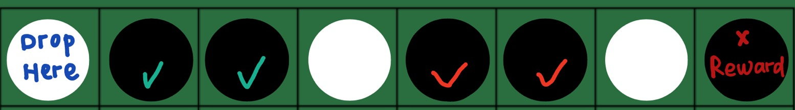
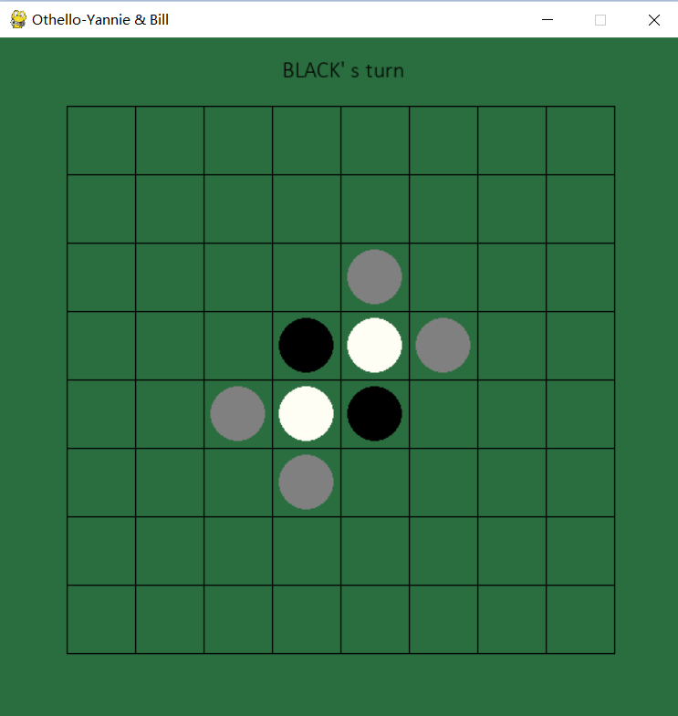

# New Reversi game (Othello)

**Members**:     
Yanying Yu/ yanying6    
Billhonam Wong/ bhwong3    

## Description:  
**project type**:  2    
**Flexiblity**:    
AI vs AI, human vs AI, human vs human.      
If there is at least one AI player, you are allowed to set the MAX_DEPTH as the difficulty (Default: 1) in the reversi_gme.py. 

**The original rules**:    
At the start of the game there are four pieces on the board, two white and two black. You must try to capture opponent pieces and flip them over so they turn into your color. You do this by making a horizontal, vertical, or diagonal line of pieces, where your pieces surround the other player's pieces. The surrounded opponent pieces are then captured and will be flipped over to your color, increasing the number of your pieces on the board. ( See the details and have a try: https://cardgames.io/reversi/ )    
### New Game rules:   
#### **1. Reversi in one direction**        
unlike flip over the opponent' s pieces in all eight directions, our game allow the player to flip over pieces in only **one** direction. So after you drop your piece, the program will show all the valid reversi direction and ask you to choose one direction to flip over.       
      
As the gif below: Now it's BLACK's turn, the grey areas are valid place to drop the piece, after dropping the piece, the orange pieces are the valid pieces you can flip over, the information on the top of the piece represents the direction(U:up, D:down, L:left, R:right) so we know in this case,we can choose L direction to flip two pieces over, or one in UL or one in U.   

    

#### **2. Reward**      
if along the choosed direction, you used only one piece to block opponents' piece(s), then you will receive an reward: Continuing the tail in this direction, if there is a possible reversi choice, the program will automatically flip over the opponent' pieces.    
      
As the gif below, now it's WHITE's turn, the grey areas are valid place to drop the piece, after dropping the piece, we can choose L direction to flip two pieces + one reward piece over, or one in UL or one in U.      

    

or in other word:    
In the following two cases, only first two black pieces could be flipped over. Because WHITE used two pieces to block the BLACK's pieces, WHITE could not get the reward.    

   

    

In this case, four black pieces could be flipped over, the two black pieces with red check mark were flipped over by the reward.   

   

## MiniMax Analysis:   
TODO
   
   

   
## How to run program:   
1. First clone our program in your local device.Make sure you have pip install all requirement packages(pygame).      
2. Run Reversi_game.py, follow the console step to enter specific information.   

   

4. Then enjoy the game in the pop out window.    

   

## Time and Space complexity:   
   
      
         
